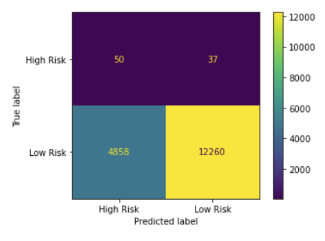

# Supervised Machine Learning Credit Risk Analysis

* Created 5JUN2022, includes scripts for both various data resampling methods and ensemble models.

## Background

The question was asked, "What information about different loans and borrowers can potentially predict if they are at 'high risk' or 'low risk' of defaulting on their agreements?" This analysis used loan data from Q1 of 2019, containing 88 columns of factors associated with each borrower. Some ranging from interest rates, some dates of next payment, some loan types, etc. This data was converted to integers when approporate, or dropped if determined to be irrelevant to the question.

Multiple methods were used, some resampling the data to provide an even analysis for low and high risk borrowers with Logistic Regression (there were far fewer "high risk" borrowers identified in the dataset than "low risk"). Other methods utilized 'ensemble' imbalanced learning modules. All of these were compared to determine what the best method may be for predicting credit risk in the data.

## Methods

Resampling methods used with Logistic Regression:

- Oversampling:
    * Random Oversampling
    * SMOTE Oversampling

- Undersampling:
    * Cluster Centroids

- Combined Methods:
    * SMOTEENN (Oversampling with removal of overlapping datapoints)

Ensemble Methods:

* Balanced Random Forest Classifier
* Easy Ensemble Classifier

## Results

The below table includes the results from the various methods used.

The below are confusion matrices for each method:

Random Oversampling

SMOTE

Cluster Centroids

SMOTEENN

Balanced Random Forest Classifier

Easy Ensemble Classifier

## Conclusions and Recommendations

The above indicates that each method saw very high precision for predicting low risk borrowers, while seeing extrememly low precision predicting high risk borrowers. Recall scores using resampling within the Logistic Regression model were highest on average for Random Oversampling and SMOTE. Individual scores were highest for Low Risk using SMOTE, and High Risk using SMOTEENN. Balanced accuracy among the resampling methods was highest for Random Oversampling. 

The ensemble methods saw recall scores on average to be highest for the Easy Ensemble Classifier, but individually the Balanced Random Forest Classifier saw the highest value for Low Risk and Easy Ensemble Classifier for High Risk. Balanced accuracy among the ensemble methods was highest for the Easy Ensemble Classifier.

Given that the dataset is imbalanced, the recall and balanced accuracy scores are the better metrics to follow. Given this, the best performing model for the data was the Easy Ensemble Classifier method. Further exploration should be done, removing columns that do not perform well (if at all) given the importance scores.